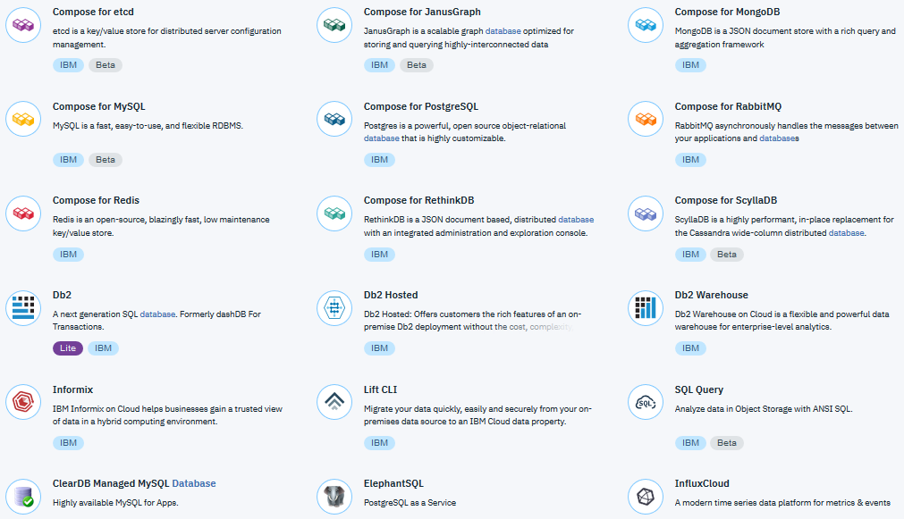
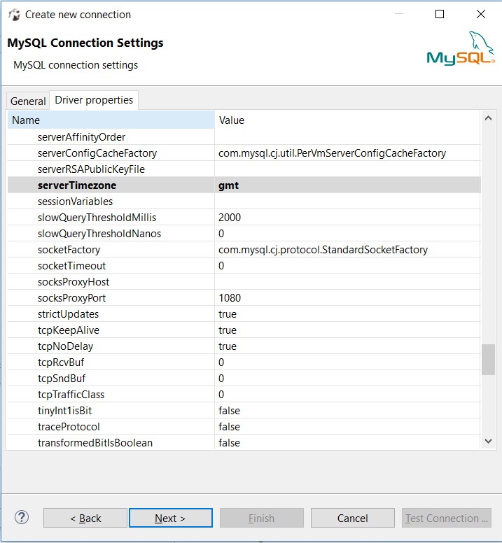
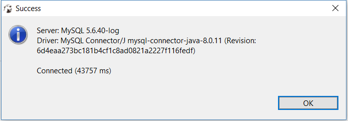
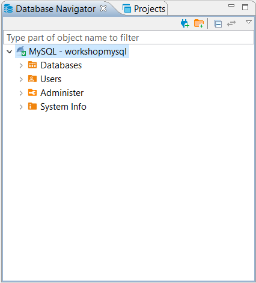

# API Connect Hands-On Labs

## Ejericio 4: Crear un servicio de base de datos en IBM Cloud

### Prerrquisitos

## Tener instalado el API Connect Toolkit [Ejercicio 1](../ex1).
## Descargar la versión portable de DBeaver en este [enlace](https://dbeaver.io/download/)
## Asegúrate que estés en el directorio correcto para el ejercicio ("ex4")

```
cd <Ruta al laboratorio>/apichol/exercises/ex4
```
### Verifica que tengas definido el Target de Cloud Foundry en tu isntancia de IBM Cloud

```
cf target
```

La salida debe ser algo como.

```
api endpoint:   https://api.ng.bluemix.net
api version:    2.92.0
user:           <Tu IBM Id>
org:            <Nombre de organización>
space:          <Nombre del espacio>
```

### Sumario

Para este ejercicio aprenderemos como crear una instancia de base de datos MySQL y poblarlo con datos de ejemplo. Este ejericio nos servirá para la construcción de nuestras API CRUD de los siguientes ejercicios.

Emplearemos DBeaver, un entorno gráfico de gestión de bases de datos open source, para crear y poblar la tabla `employee` que utlilizaremos en los siguientes ejercicios

### Paso 1: Crear el servicio de base de datos

Las bondades de las Nubes de hoy día está en la capacidad de poder crear servicios al toque, gracias al modelo de consumo de Plataforma como Servicio (PaaS). Por ejemplo, te mostramos el catalogo de servicios de bases de datos que ofrece IBM Cloud.



Para nuestro ejercicio utilizaremos MySQL ofrecido en la nube de IBM. MySQL es una base de datos relacional (DBRMS) open source.

Para instanciar un servicio en IBM Cloud se requieren tres campos:

- **Nombre del servicio a instanciar**: Es el nombre definido en IBM Cloud para un servicio en particular
- **Plan a aplicar al servicio**: Son las modalidades en que se puede consumir el servicio, Calidad de servicio (QoS) y precio
- **Nombre de la instancia a crear**: Definido por usuario y será un identificador único de la instancia del servicio que permitirá enlazarle a otros servicios dentro de la Nube.

Lo primero que haremos es obtener los detalles del servicio que precisamos para nuestro ejercicio. Para ello haremos una búsqueda en el _market place_ de IBM Cloud para ubicar el servicio de MySQL. En este caso, tomaremos **Cleardb**

```
cf marketplace -s cleardb
```

El resultado de ejecutar este comando se muestra a continuación

```
Getting service plan information for service cleardb as <IBM Id>...
OK

service plan   description                           free or paid
cb5            Free trial for evaluation purposes.   free
cb10           For light MySQL workloads.            paid
cb20           For modest MySQL workloads.           paid
cb30           For moderate MySQL workloads.         paid
cb40           For large MySQL workloads.            paid
cb50           For very large MySQL workloads.       paid
```

Para nuestros fines, tomaremos el plan **cb5** que nos ofrece las siguientes características

- Tamaño de la base de datos: 10MB
- Conexiones concurrentes: Hasta 5
- Desempeño I/O: Bajo
- Respaldos diarios
- Gratis :)

Ahora, crearemos nuestra instancia de base de datos Cleardb usando el siguiente comando:

```
cf create-service cleardb cb5 workshopmysql
```

El resultado debe lucir como este

```
Creating service instance workshopmysql in org <Nombre de la organización> / space <Nombre del espacio> as <IBM Id>...
OK
``` 
**Excelente!** Acabamos de crear nuestra base de datos en IBM Cloud utilizando comandos de Cloud Foundry. Ahora a crear las credenciales de conexión a nuestra base de datos.

### Paso 2: Crear credenciales de acceso a nuestra instancia de BD

Ejecutaremos el siguiente comando para crear las credenciales que precisamos para acceder a nuestra instancia.

```
cf create-service-key workshopmysql connectioncreds
```

El resultado debe ser algo como esto:

```
Creating service key connectioncreds for service instance workshopmysql as <IBM Id>...
OK
``` 

Ahora, obtendremos los valores generados empleando el siguiente comando:

```
cf service-key workshopmysql connectioncreds
```
La salida debe lucir como esto:

```
{
 "hostname": "us-cdbr-xxxx-xxxx-36.cleardb.net",
 "jdbcUrl": "jdbc:mysql://us-cdbr-xxxx-xxxx-36.cleardb.net/ad_2xxxxxxxxxxxf?user=b2xxxxxxxxxx7\u0026password=1xxxxxx7",
 "name": "ad_2xxxxxxxxxxxf",
 "password": "1xxxxxx7",
 "port": "3306",
 "uri": "mysql://b2xxxxxxxxxx7: 1xxxxxx7@us-cdbr-xxxx-xxxx-36.cleardb.net:3306/ad_2xxxxxxxxxxxf?reconnect=true",
 "username": "b2xxxxxxxxxx7"
}
```

Con esta información podemos establecer una conexión JDBC a nuestra instancia. Ahora a llenar la base de datos!

### Paso 3: Poblar la base de datos:

En el ejercicio hemos preparado un archivo (`populate.sql`) con algunos datos de empleados para nuestra instancia de base de datos. Los datos a insertar lucen como este extracto del archivo.

```
INSERT INTO `employees`
(emp_no, birth_date, first_name, last_name, gender, hire_date)
VALUES      (10001, 
             '1953-09-02', 
             'Georgi', 
             'Facello', 
             'M', 
             '1986-06-26'), 
[....]
```
Con el fin de facilitar este trabajo, usaremos DBeaver para ejecutar nuestros scripts:

Primero configuraremos el conector a MySQL de DBeaver. Buscamos en la lista de drivers "MySQL"


Configuraremos los datos de: **Server Host**, **Port**, **Database**, **User name** y **Password** de acuerdo con los valores generados en el proceso de creación de credenciales

**Importante!** - Se requiere hacer una configuración de propiedades del Driver, en al pestaña "Driver Properties", el atributo "serverTimeZone" al valor "gmt". Tal como se indica en la siguiente figura



Probamos la conexión usando el botón "Test connection...". Debemos ver una ventana indicando que la conexión fue exitosa



Bien. Casi prontos para terminar. Ahora le damos dos veces "Next >". Colocamos el nombre de la conexión "MySQL - workshopmysql" y pulsamos "Finish". _Voilà_

Hacemos doble click en el conector que creamos para establecer la conexión. Esto puede tardar un poco en ejecutarse. El resultado debe verse de esta forma



En el menú "File" damos la opción "Open file...". Buscamos el directorio del ejercicio y abrimos el archivo `setup.sql` Eso nos debería cargar en el editor de SQL la sentencia para crear la tabla `employee` para nuestro ejercicio. 

Una vez cargado el script, pulsaremos `<Ctrl> + <Enter>` para ejecutar el script. Con esto, habremos creado la tabla

Repetimos los pasos anteriores para cargar los datos en el archivo `populate.sql`

**Felicitaciones!** Hemos cargado y poblado nuestra base de datos MySQL en la nube de IBM

### Resumen del Ejercicio
Hemos configurado una instancia de base de datos MySQL usando la CLI de Cloud Foundry en IBM Cloud. Hemos creado las credenciales de acceso a nuestra instancia usando la CLI de Cloud Foundry. Por último, descargamos y confiuramos DBeaver para tener un entorno gráfico para gestionar nuestra base de datos en la Nube. Creamos la tabla `employee`y le hemos cargado un conjuno de datos de pruebas que usaremos en los siguientes ejercicios.

En el [ejercicio 5](../ex5) emepezaremos nuestro viaje en la creación de las APIs CRUD para la base de datos que acabamos de configurar.
