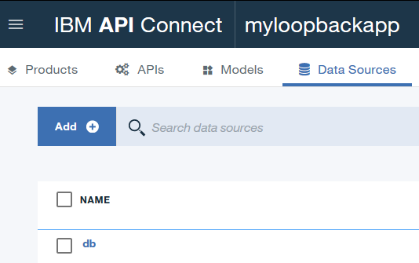
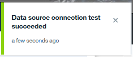
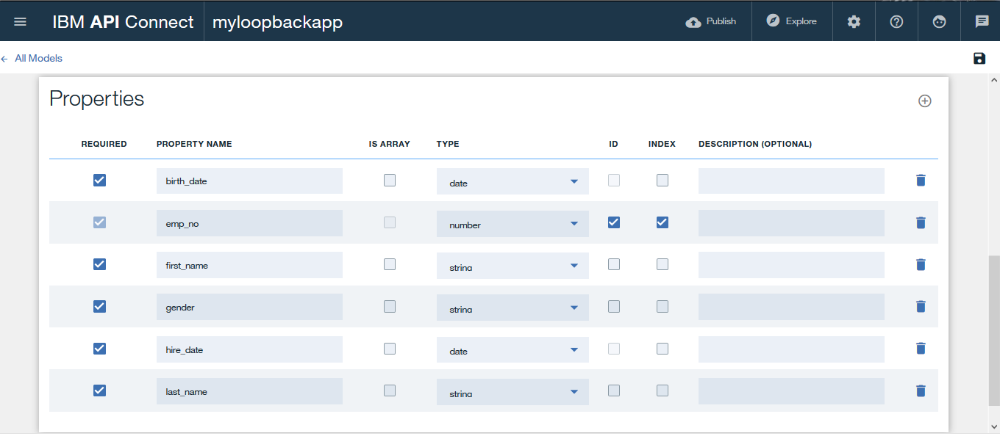

# API Connect Hands-On Labs

## Ejercicio 5: Crear APIs CRUD a base de datos con modelos LoopBack

### Prerrequisitos

Para este ejercicio precisamos:

**Tener instalado el toolkit de API Connect** del [ejericio 1](../ex1).

**La app de Loopback** del [ejericio 3](../ex3)

**La base de datos Cleardb** del [ejercicio 4](../ex4)

### Sumario

En este ejercicio crearemos unas APIs CRUD sobre `employees` de nuestra base de datose.

### Paso 1: 

**Importante!** ha diferencia de ejercicios anteriores, esta vez tenemos que estar en el directorio del ejercicio 3 donde reside nuestra App Loopback

```
cd <Ruta al laboratorio>\apichol\exercises\ex3
```

### Paso 1: Instalar conector de MySQL para Loopback

Accedemos al directorio de nuestra aplicación loopback

```
cd loopback\myloopbackapp
```

Descargaremos y configuraremos el conector de Loopback para bases de datos MySQL. Para ello ejecutaremos el siguiente comando

```
npm i --save loopback-connector-mysql
```

### Paso 2: Crear conexión a la base de datos Cleardb

Accederemos al editor de APIs de API Connect utilizando el siguiente comando

```
set SKIP_LOGIN=true
apic edit
```

Seleccionaremos la viñeta "Data Sources" y daremos click en el botón "Add (+)" con el nomnbre "mysql-db"



Llenaremos los valores con los siguientes datos:

- **Connector**: MySQL
- **URL**: El valor "URI" que obtuvimos al generar las credenciales de acceso en el [ejercicio 4](../ex4)
- **Database**: El valor "name" que obtuvimos al generar las credenciales de acceso en el [ejercicio 4](../ex4)

Luego presionaremos el ícono salvar en la parte superior derecha (Ícono de diskette). Ahora comprobaremos que nuestra conexión está funcionando. Presionaremos el ícono del hombre corriendo (Test Data Source Conection) y debemos obtener el siguiente resultado



### Paso 3: Crear modelos CRUD para la base de datos

Con la conexión a la base de datos probada, hacemos click en "<- All data sources" para regresar.

Ahora, haremos click en la viñeta "Models". Haremos click en "Add (+)" para crear un nuevo modelo y le pondremos el nombre `employees` y pulsaremos el botón "New"

En el campo "Data Source", seleccionaremos el valor "mysql-db". Haremos la carga de propiedades de acuerdo con la siguiente captura de pantalla.



Este modelo nos permitirá mapear los parámetros de nuestra API con campos de nuestra tabla. Los tipos de datos de Loopback mapean con los MySQL de forma que no se precisa conversión explícita de los valores en las llamadas a nuestra API. Finlizaremos el ejercicio pulsando el ícono salvar, en la parte superior derecha. Hecho esto, API Connect genera de forma automática las APIs representadas en el modelo.

**Felicitaciones!** Acabas de crear las APIs CRUD basado en un modelo de Loopback.


### Resumen del ejercicio

Creamos un datasource para una base de datos MySQL a nuestra aplicación Loopback. Creamos un modelo de Loopback basado en la estructura de `employees` de nuetra base datos usando API Connect y se generaron las API CRUD de nuetro modelo de forma automática.

En el [ejercicio 6](../ex6) probaremos, eploraremos y desplegaremos nuestra aplicación Loopback.
