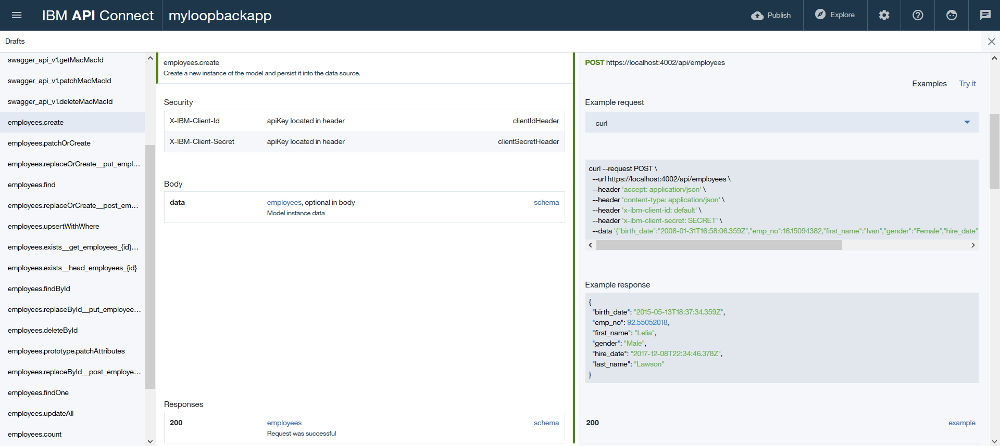
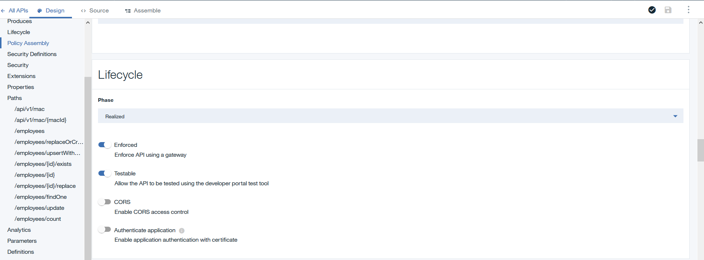
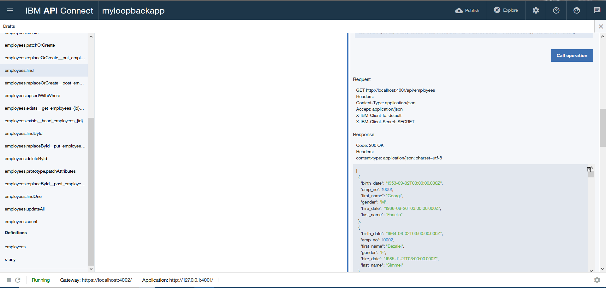
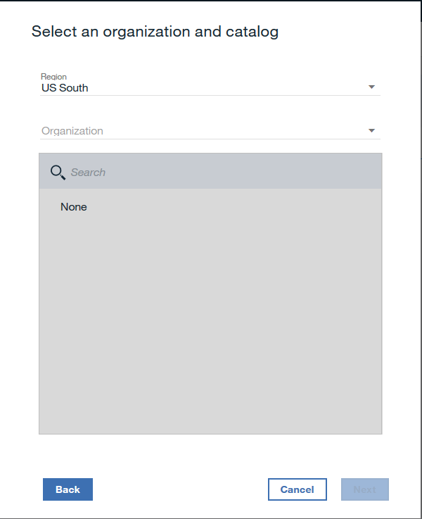
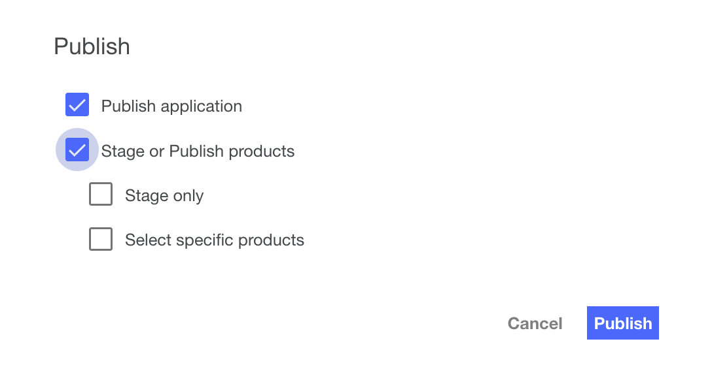

# API Connect Hands-On Labs

## Ejercicio 6: Probar, Explorar y desplegar aplicaciones LoopBack

### Prerrequisitos

Este ejercicio requiere de lo siguiente:

**Tener instalado el toolkit de API Connect** del [ejericio 1](../ex1).

**La app de Loopback** del [ejericio 3](../ex3)

**La base de datos Cleardb** del [ejercicio 4](../ex4)

**APIs CRUD** del [ejercicio 5](../ex5)

### Sumario

En este ejercicio veremos el fruto del trabajo hasta ahora realizado. Probaremos nuestras APIs y exploraremos el Swagger generado, para luego, hacer nuestro despliegue en IBM Cloud

### Paso 1: Levantemos el Ambiente

**Importante**: Aseguremos estar en el directorio del ejercicio 3

```
cd <Ruta al laboratorio>\apichol\exercises\ex3
```  

Accedamos al directorio de nuestra aplicación loopback

```
cd loopback\myloopbackapp
```

Iniciemos el toolkit de API Connect empleando este comando

```
set SKIP_LOGIN=false
apic edit
```

Esta vez utilicemos nuestra credencial de acceso a IBM Cloud (También llamado IBM Id). 

Una vez halla cargado el toolkit, levantaremos nuestra aplicación pulsando el botón "Play" ubicado en la parte inferior izquierda. Nuestra aplicación estará arriba una vez veamos "Running..." barra de estado como en la siguiente imagen


Como podemos ver, existen dos direcciones: **Gateway** y **Application**. El primero representa la puerta de entrada de nuestras APIs, donde podemos configurar políticas de seguridad para proteger nuestras APIs. El segundo es donde está el _end-point_ de nuestra APIs.

### Paso 2: Exploremos nuestra API

Ahora que está arriba nuestro ambiente, probemos llamar a algunas APIs!

Pulsemos el botón de "Explore" (Compás) en la parte superior derecha. Esto nos mostrará el documento swagger con todos los servicios REST disponibles



En el swagger podemos ver los servicios creados en el ejericio 3 y en el 5. Ahora probemos los servicios

### Paso 3: Ejecutemos una API

Probemos hacer una consulta de nuestros empleados usando el servicio **GET /Employees**. Antes, precisamos desactivar CORS (Cross-origin Resource Sharing) que es una política de seguridad para evitar que los recursos sean accesibles fuera del dominio definido. Para ello, haremos click en la viñeta "APIs" y seleccionaremos nuestra API.

En el panel izquierdo seleccionaremos "Lifecycle", para luego desactivar la validación CORS.



Ahora procederemos con la prueba de nuestro servicio. Volvamos a dar click en "Explore" y seleccionemos de los _drafts_ employees.find

Haremos click en el enlace "Try it" y luego en el botón "Call operations"



### Paso 4: Despleguemos en IBM Cloud

Habiendo validado el funcionamiento de nuestra API, procederemos a subir a la nube nuestro servicio. Para ello pulsaremos el botón de "Publish" (Nube con la flecha hacia arriba), que se encuentra en la parte superior derecha, y seleccionaremos "Add and manage targets"

Seleccionaremos "Add IBM bluemix target". Y nos aparecerá este formulario



**Importante**: Asegurate de elegir la organización y espacio correctos. 

Ahora crearemos nuestra aplicación. Nombremosla `EmployeeAPI` y pulsemos el botón "(+)" y luego pulsa "Salvar".

En estos pasos hemos creado un destino de publicación en IBM Cloud. Ahora subiremos nuestra API pulsando, nuevamente, el botón Publish y seleccionamos el target que acabamos de crear.

Selecciona las opciones `Publish Application` y `Stage or Publish products`, luego pulsa el botón "Publish". Con eso empezará a subirse la aplicación a la nube de IBM.



Para ir monitoreando el estado de carga de nuestra aplicación, utilizaremos este comando de la CLI de Cloud Foundry.

```
cf app employeeapi
```

Nuestra app estará lista en el momento que la respuesta del comando diga `requested state: started`. Desde ese momento, podemos usar API Connect en IBM Cloud para gestionar nuestra API directamente en la nube

### Resumen del Ejercicio

En este ejercicio hemos aprendido a crear un ambiente local para hacer pruebas unitarias de nuestra API. Pudimos hacer pruebas desde API Connect para ver el comportamiento de los servicios que componen nuestra API. Finalmente, publicamos nuestra API en la nube de IBM para gestionarla en ambiente productivo.

En el [ejercicio 7](../ex7) finalizaremos nuestro viaje usando API Manager en IBM Cloud y viendo las funcionalidades del portal de desarroladores de API Connect.
