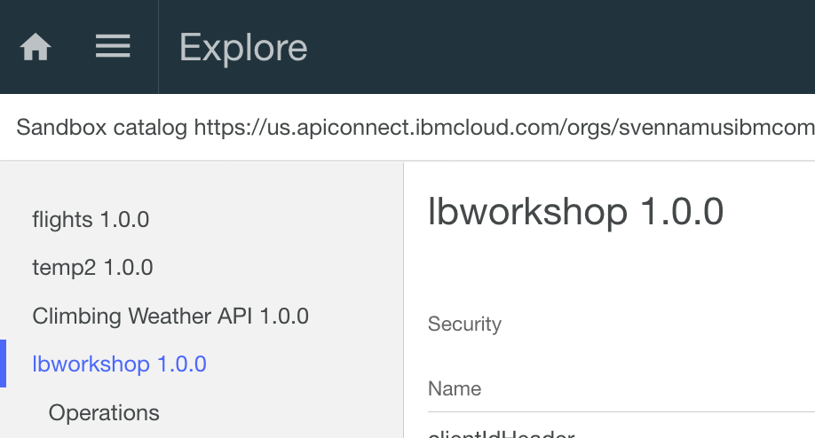

# API Connect Hands-On Labs

## Ejercicio 7: Explorar APIs desplegados con API Manager en IBM Cloud

### Prerrequisitos

Este ejercicio requiere de lo siguiente:

**Tener instalado el toolkit de API Connect** del [ejercicio 1](../ex1).

**La app de Loopback** del [ejercicio 3](../ex3)

**La base de datos Cleardb** del [ejercicio 4](../ex4)

**APIs CRUD** del [ejercicio 5](../ex5)

**Publicación de las APIs en IBM Cloud** del [ejercicio 6](../ex6)

### Sumario

Ahora veremos nuestras APIs en IBM Cloud, utilizaremos API Connect para validar el funcionamiento de nuestra App y APIs.

### Paso 1: Accediendo las APIs desplegadas

Entrando en [IBM Cloud](https://new-console.ng.bluemix.net) accederemos a API Connect. Esto lanzará el gestor de APIs, que es una intefaz muy parecida a la del designer que hemos usado  a lo largo de este laboratorio.

En la lista de APIs podemos ver `EmployeeAPI` en la lista. Por lo que haremos click en "Explore" para ver los servicios que disponemos. 

### Paso 2: Ejecutemos nuestras APIs

Probemos hacer una consulta de nuestros empleados usando el servicio GET /Employees. Antes, precisamos desactivar CORS (Cross-origin Resource Sharing) que es una política de seguridad para evitar que los recursos sean accesibles fuera del dominio definido. Para ello, haremos click en la viñeta "APIs" y seleccionaremos nuestra API.

Los resultados esperados son los mismos que tuvimos en el ejercicio anterior.

### FELICITACIONES!!!!

Acabas de terminar el taller de APIs usando API Connect. Si quieres seguir explorando las capacidades de Gobierno, te invitamos a que continues con los tutoriales de IBM Cloud:

- **Managing APIs**: https://console.bluemix.net/docs/services/apiconnect/managing_apis.html#managing_apis
- **Managing Products**: https://console.bluemix.net/docs/services/apiconnect/managing_products.html#managing-products
- **Exploring APIs and Products**: https://console.bluemix.net/docs/services/apiconnect/explore_apis.html#view_test_apis_dev_port

Gracias por participar!
